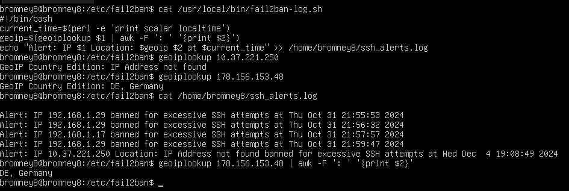
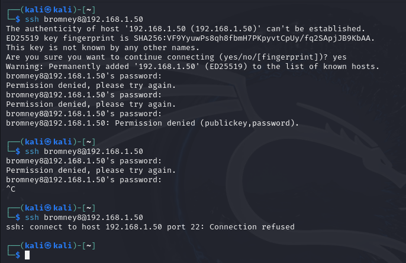
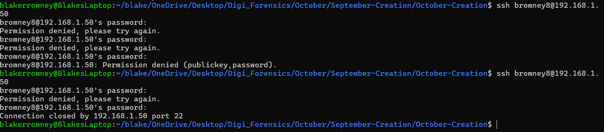

# November Creation
### Fail2Ban
Rodriguez, Eduardo  
Romney, Blake  
Womack, Payton

## Purpose
The additions in the November creation are designed to improve our October creation by implementing additional enumeration of the banned IP addresses; enumerating the geographic location of the IP address and including that in the log. The November creation has many of the same features and settings as the October creation, fail2ban monitors the iptable logs and when it detects 4 invalid ssh login attempts in one minute, it creates a new iptable rule banning that ip address for a time (demonstrated here as 5 minutes; in practice it may be more appropriate to do 1, 12, or 24 hrs). Once this happens, fail2ban also launches a custom action. In this case, we have implemented a bash script to write to a custom log file in the users home directory the IP that was blocked, it's geographic location and the timestamp. Using fail2ban we can efficiently ban an IP address for a longer duration than the time in which we monitored for malicious actions as well as launch other scripts to aid in protecting your system from threats.

## Application
***To set up fail2ban***  
_Note: Development and testing was done on Ubuntu 24.04.1 x86 Server VM_ 

- On your Linux CLI run:

      sudo apt update
      sudo apt install fail2ban
      sudo apt install geoip-bin geoip-database
- Create a custom jail configuration for SSH by copying ```sshd.conf``` to ```/etc/fail2ban/jail.d/sshd.conf```
- Create the custom action file by copying ```ssh-alert.conf``` to ```/etc/fail2ban/action.d/ssh-alert.conf```
- Then create the logging script by copying ```fail2ban-log.sh``` to ```/usr/local/bin/fail2ban-log.sh```. Be sure to change the path to your home directory. Make the script executable.

      sudo chmod +x /usr/local/bin/fail2ban-log.sh
- Create the log file and set it's permissions by running the following commands

      sudo touch /home/{user}/ssh_alerts.log
      sudo chmod 644 /home/{user}/ssh_alerts.log

- Enact these changes
        
      sudo systemctl restart fail2ban
      sudo systemctl enable fail2ban


## Proof of Value  
Fail2Ban automatically detects and blocks IP addresses that attempt to brute-force SSH access. This is particularly useful for preventing attackers from repeatedly trying to guess login credentials.  


In the above screenshot, we can see multiple entries in the ssh_alerts.log file showing that the IP addresses 192.168.1.29 and 192.168.1.17 were banned for excessive SSH attempts. This demonstrates that Fail2Ban is actively monitoring and responding to suspicious activity in real-time and the custom reporting alert script was correctly running. 

**New to the November creation** is the geographic location of the offending IP address. Due to development only occuring on a local network, geographic location could not be assessed. To prove that the script is able to accurately predict the locations of IP addresses, the commands to do so were manually run with a non-local ip address:  
*as demonstrated in the above screenshot*  

    bromney8@bromney8:/etc/fail2ban$ geoiplookup 178.156.153.48
    GeoIP Country Edition: DE, Germany   
           

The script cuts the output into two variable at the ": " and outputs only the country code and name to the log file. Understanding the physical locations of the IP addresses gives administrators increased awareness and context of incoming attacks allowing them to make more informed decisions and better protect their systems.

We've configured the reporting script to log each ban event to a custom file (/home/{user}/ssh_alerts.log). This gives administrators a clear record of which IPs were banned and when.

As shown in the first screenshot, the log file is filling up with alerts, each entry providing the banned IP address, country of origin, timestamp (Thu Oct 31 21:55:53 2024, etc.) and details about the banned IP address. This makes it easy to track when attacks are happening and from where.

Once an attacker exceeds the allowed number of failed login attempts (in this case, 4 attempts within 1 minute), Fail2Ban immediately blocks further attempts by adding an iptables rule to drop any traffic from that IP.



The above screenshot shows an attacker using ssh from a Kali Linux machine attempting multiple failed SSH logins to the server at 192.168.1.50. After several failed attempts, the connection is refused (ssh: connect to host 192.168.1.50 port 22: Connection refused), indicating that Fail2Ban has successfully blocked further access from that IP.
This immediate response greatly reduces the risk of unauthorized access and prevents attackers from continuing their brute-force attempts. Another example is shown below from a WSL CLI.




Fail2Ban is highly configurable, allowing administrators to set parameters such as how many failed login attempts are allowed before a ban occurs (maxretry), how long an IP should be banned (bantime), and how far back in time those attempts are counted (findtime).

In our setup, we've configured Fail2Ban to ban an IP after 4 failed login attempts within a 1-minute window (findtime = 60) and produce a log of ip address, location, and timestamp in the users home directory. The ban lasts for 1 hour (bantime = 300). These settings can be changed in production to more realistic standards, ensuring that legitimate users who make occasional mistakes are not permanently locked out while still protecting against persistent attackers.
